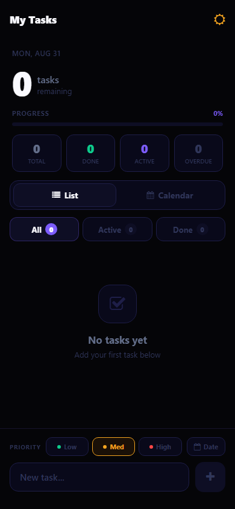
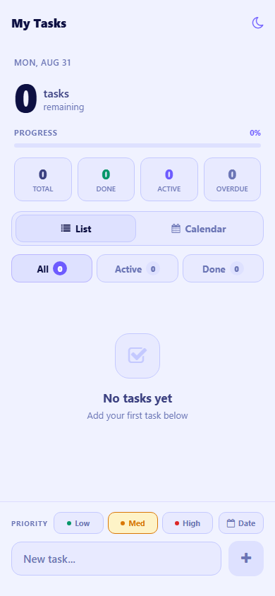
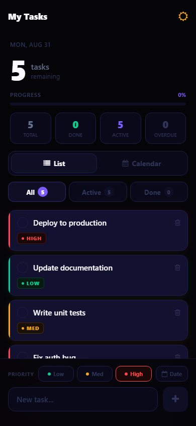
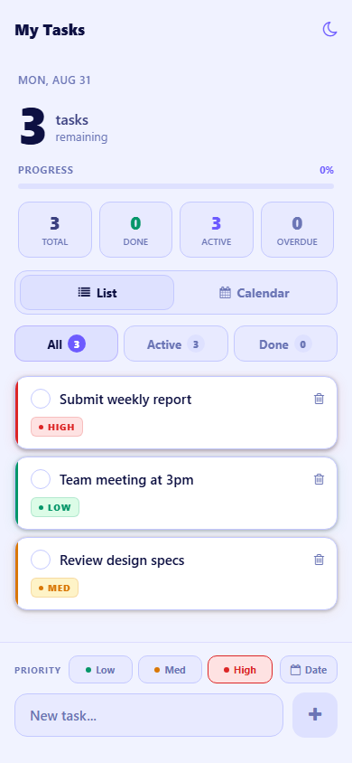
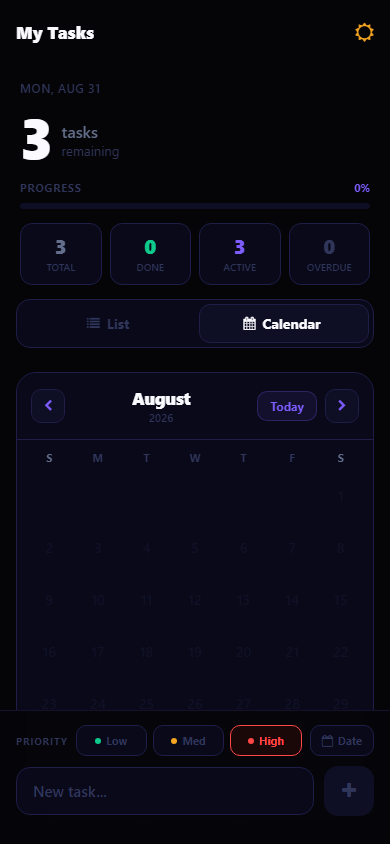
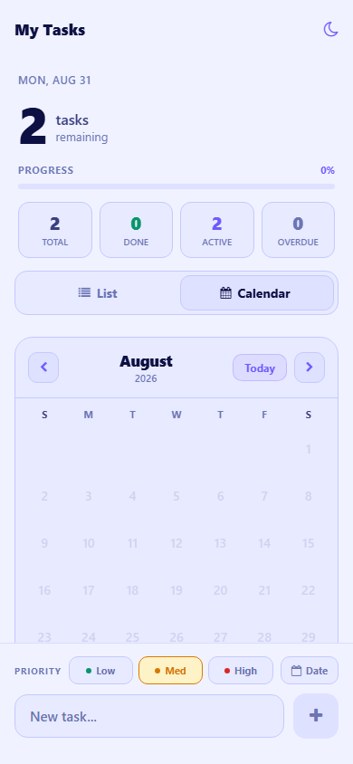

# My Tasks — Todo App

A premium mobile todo app built with **Expo** and **React Native**, featuring dark/light themes, calendar view, and priority management.

## Screenshots

| Dark Mode | Light Mode |
|-----------|------------|
|  |  |
|  |  |
|  |  |

## Features

- **Dark / Light mode** toggle
- **List & Calendar** views
- **Priority levels** — Low / Med / High with color indicators
- **Filter tabs** — All / Active / Done
- **Progress tracking** — Total, Done, Active, Overdue stats
- **SQLite** local storage via `expo-sqlite`
- Add, complete, and delete tasks

## Tech Stack

- [Expo](https://expo.dev) ~57
- React Native 0.86
- Expo Router (file-based navigation)
- Expo SQLite (local database)
- TypeScript

## Getting Started

```bash
npm install
npx expo start
```

Then press `w` for web, `a` for Android, or `i` for iOS.

## License

MIT
